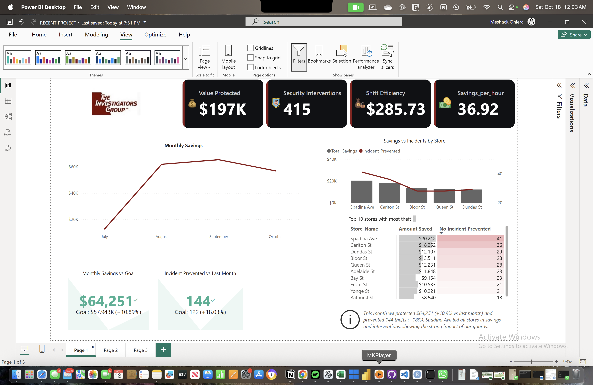
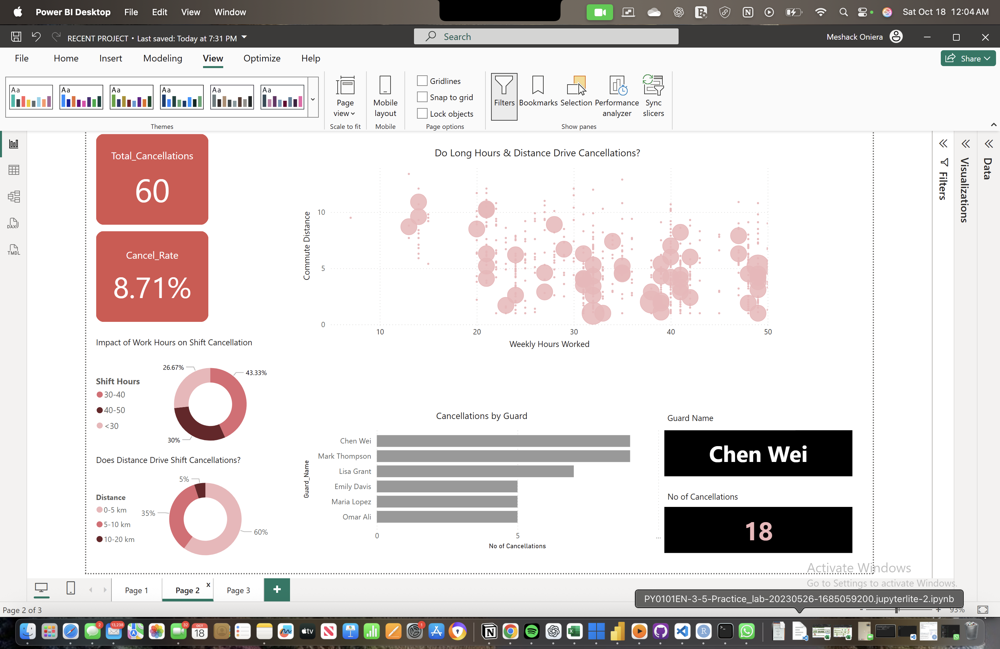

# 🛡️ Security ROI Dashboard

**Tool:** Power BI  
**Domain:** Retail Security Analytics  
**Type:** Business Intelligence Dashboard  

---

## 📘 Project Overview
This project analyzes the **return on investment (ROI)** of security operations for retail clients such as **Metro** and **Food Basics**.  
As part of my experience working with a security firm, I noticed that prevention data sent to clients was mostly numeric — making it difficult to communicate how much value or savings our guards were actually generating.

To bridge that gap, I built an **interactive Power BI dashboard** that quantifies our impact in financial and operational terms — showing cost savings, guard efficiency, and cancellation patterns.

---

## 🎯 Objectives
- Visualize **monthly savings** achieved by security interventions.  
- Track **incident prevention trends** across different store locations.  
- Measure **shift efficiency** and **average savings per hour**.  
- Explore **causes of guard shift cancellations** using real-world insights (distance, work hours, fatigue).

---

## 📊 Dashboard Pages

### **Page 1 – Executive ROI Overview**


- **KPIs:**  
  - Value Protected  💰 $197 K  
  - Security Interventions  🛡️ 415  
  - Shift Efficiency  📈 $285.73  
  - Savings per Hour  ⏱️ $36.92  

- **Visuals:**  
  - Line chart – Monthly savings trend (July – October).  
  - Top 10 stores by amount saved and incidents prevented.  
  - Goal variance cards showing performance against targets.

**Insight:**  
> The organization achieved over $64 K in monthly savings (+10.9% vs goal), preventing 144 incidents (+18% vs previous month).  
> Spadina Avenue and Carlton Street were top-performing locations in value protected.

---

### **Page 2 – Shift Cancellations Analysis**


- **Metrics:** Total Cancellations = 60  |  Cancel Rate = 8.7%  
- **Visuals:**  
  - Scatter plot – Correlation between hours worked and commute distance.  
  - Donut charts – Impact of long work hours and distance on shift cancellations.  
  - Bar chart – Cancellations by guard (name level view).

**Insight:**  
> Guards working 40 + hours per week or commuting over 10 km had higher cancellation rates, indicating fatigue and distance as key factors affecting reliability.

---

## 🧠 Business Impact
This dashboard converts operational data into a clear ROI story for clients:
- **Quantifies savings** from security interventions in monetary terms.  
- **Identifies performance gaps** and optimization areas (e.g., scheduling fatigue).  
- **Improves communication** between security management and retail clients through visual storytelling.  

---

## 🧩 Tools & Techniques
- **Power BI**        – Data modeling, DAX KPIs, visual design.  
- **Excel / CSV**   – Base data cleaning and import.  
- **DAX Formulas**  – Calculated columns for savings, efficiency, and variance.  
- **Project Management Insight** – Root-cause analysis (“5 Whys”) applied to shift cancellations.

  ---


<details>
<summary>📊 <b>DAX Highlights</b> (click to expand)</summary>

Key DAX measures powering the ROI dashboard:

```DAX
-- Total shifts worked
Total_Shifts = COUNTROWS(Shifts)

-- Total savings ($)
Total_Savings = SUM(Shifts[Estimated_Savings_$])

-- Efficiency metrics
Avg_Savings_Per_Shift = DIVIDE([Total_Savings], [Total_Shifts])
Cancel_Rate = DIVIDE([Total_Cancellations], [Total_Shifts])

-- Month-over-Month comparison
Prev_Month_Savings =
    CALCULATE([Total_Savings], PREVIOUSMONTH('Date'[Date]))
MoM_Savings_% =
    DIVIDE([Total_Savings] - [Prev_Month_Savings], [Prev_Month_Savings])
</details>

## 🗂️ Repository Structure

Security-ROI-Dashboard/
│── Security-ROI-Dashboard.pbix # Power BI file
│── Page1_Overview.png     # Executive ROI page screenshot
│── Page2_Cancellations.png  # Shift analysis page screenshot
│── LICENSE
│── README.md
---

## 🍀 Key Takeaway  
> A real-world **data solution** built from an on-the-job problem — transforming raw incident logs into an **insightful business intelligence dashboard** that quantifies security impact and ROI.

---

## 👤 Author  
**Meshack Oniera**  
📊 *Data Analyst | Power BI | SQL | Excel | Python*  

🔗 [LinkedIn Profile](https://www.linkedin.com/in/meshackoniera)  
📁 Part of the [Exera Analytics Portfolio](https://github.com/keno1278)

